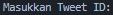
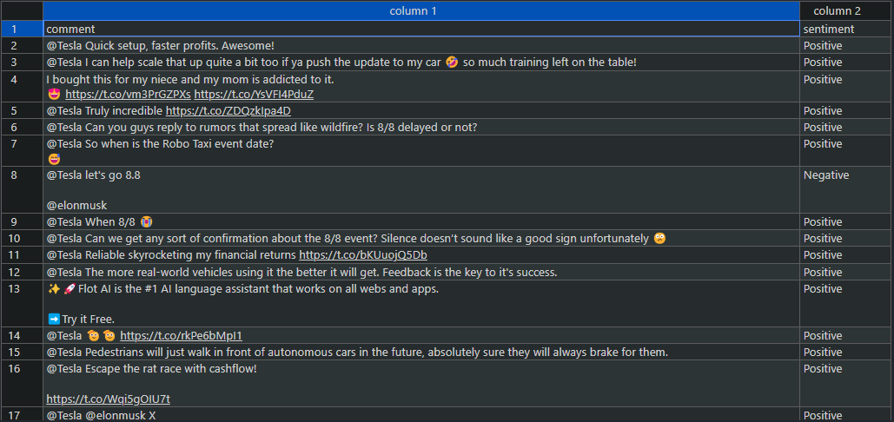

# SENTIMENT ANALYSIS USING MACHINE LEARNING ON SOCIAL MEDIA PLATFORM X (TWITTER)

# SUPPORT

| Version        | Application              |
| -------        | ------------------       |
| 22.04.2 LTS    | Ubuntu (Jammy Jellyfish) |
| 3.10.12        | Python                   |

# DESCRIPTION

[Dokumentasi dalam bahasa Indonesia](doc/indonesia/README.md)

This system uses machine learning and Natural Language Processing (NLP) technologies to perform sentiment analysis on comments from Twitter. In its implementation, this script collects comment data through the Twitter API provided by RapidAPI. These comments are then processed using NLP techniques such as text cleaning to remove URLs, mentions, hashtags, and non-alphabet characters, as well as removing stopwords. Subsequently, sentiment analysis is performed using VADER (Valence Aware Dictionary and sEntiment Reasoner), a tool designed for sentiment analysis of text written on social media. The results of the VADER sentiment analysis are used to label the data as positive, negative, or neutral. The labeled data is then used to train a machine learning model using the Logistic Regression algorithm, a classification algorithm that predicts the probability of binary outcomes. The model is trained with features extracted using TF-IDF Vectorizer, which converts text into numerical representations based on word frequency. After training, the model is evaluated and used to predict the sentiment of new comments, with the final results being saved to a CSV file. This combination of technologies enables the system to effectively analyze and classify the sentiment of social media text.

# USAGE

## OBTAINING API ACCESS FROM RAPID API

First, obtain the API key from [RapidAPI (Twitter Scraper)](https://rapidapi.com/omarmhaimdat/api/Twitter). Next, open the `config.json` file and paste the API key in the designated section.


# RUN THE PROGRAM

To run the program, use the command:

```
$ python3 main.py
```


Next, you can enter the tweet ID in the input that appears. 

To get the tweet ID, you can take the unique number after the status endpoint on the post you want to target.

Example URL: https://x.com/Tesla/status/1811482352495026422

Tweet ID: 1811482352495026422 

Results:


Data preview:

[CSV Data](/sentiment_analysis_results.csv)


