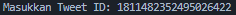

# SENTIMENT ANALISIS DENGAN MENGGUNAKAN MECHINE LEARNING PADA PLATFORM MEDIA SOSIAL X (TWITTER)

Sistem ini menggunakan teknologi machine learning dan Natural Language Processing (NLP) untuk melakukan analisis sentimen terhadap komentar dari Twitter. Dalam implementasinya, skrip ini mengumpulkan data komentar melalui API Twitter yang disediakan oleh RapidAPI. Komentar-komentar tersebut kemudian diproses menggunakan teknik NLP seperti pembersihan teks untuk menghapus URL, mentions, hashtags, dan karakter non-alfabet, serta menghilangkan stopwords. Selanjutnya, analisis sentimen dilakukan menggunakan VADER (Valence Aware Dictionary and sEntiment Reasoner), sebuah alat yang dirancang untuk analisis sentimen teks yang ditulis di media sosial. Hasil analisis sentimen VADER digunakan untuk melabeli data sebagai positif, negatif, atau netral. Data yang telah dilabeli kemudian digunakan untuk melatih model machine learning menggunakan algoritma Logistic Regression, sebuah algoritma klasifikasi yang memprediksi probabilitas hasil biner. Model dilatih dengan fitur-fitur yang diekstraksi menggunakan TF-IDF Vectorizer, yang mengubah teks menjadi representasi numerik berdasarkan frekuensi kemunculan kata. Setelah pelatihan, model dievaluasi dan digunakan untuk memprediksi sentimen komentar baru, dengan hasil akhirnya disimpan ke dalam file CSV. Kombinasi teknologi ini memungkinkan sistem untuk secara efektif menganalisis dan mengklasifikasikan sentimen dari teks media sosial.

# PENGGUNAAN

## MENGAMBIL AKSES API DAARI RAPID API

pertama-tama, ambil apikey di [RapidAIP (Twitter Scraper)](https://rapidapi.com/omarmhaimdat/api/Twitter). Selanjutnya buka file `config.json` dan paste apikey pada bagian ini.


# JALANKAN PROGRAM

untuk menjalankan program dapat menggunakan perintah.

```
$ python3 main.py
```

Selanjutnya anda dapat memasukan tweet id pada input yang akan muncul. 

Untuk mendapatkan tweet id, adan dapat mengambil angka unik setelah endpoint status pada postingan yang anda ingin targetkan.

Contoh url: https://x.com/Tesla/status/1811482352495026422

Tweet id: 1811482352495026422 

Results:


Data preview:

[CSV Data](/sentiment_analysis_results.csv)

